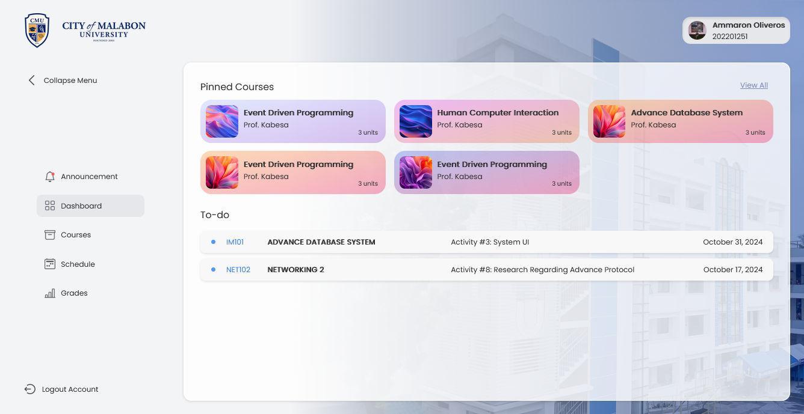

# CMU LMS Visual Design


A static LMS web design concept inspired by the City of Malabon University (CMU) portal experience.

> **Disclaimer:** This project is for visual inspiration and educational design exploration only. It is not an official City of Malabon University system, is not connected to any university service, and is not intended for credited academic, administrative, or production use.

## Overview

This repository contains a front-end-only mockup of an LMS portal, including a sign-in screen and sample student portal pages. The pages are built with plain HTML, CSS, and JavaScript so they can be opened and reviewed without a backend.

## Included Pages

- Sign-in screen
- Dashboard
- Courses
- Announcements
- Grades
- Profile
- Schedule

## Tech Stack

- HTML5
- CSS3
- Vanilla JavaScript
- Local image and font assets

## Running Locally
[View live demo](https://cmu-lms-static.vercel.app/)

No build step or package installation is required.

1. Clone or download this repository.
2. Open `index.html` in a browser.
3. Use the page navigation to explore the static portal screens.

A local static server can also be used if preferred, for example:

```bash
python -m http.server
```

Then open `http://localhost:8000`.

## Scope and Limitations

- There is no backend or database.
- The sign-in form is a visual interaction only and does not authenticate users.
- User data, grades, schedules, announcements, and course information are sample content.
- No academic credit, official university workflow, or real student record should be associated with this project.

## Project Structure

```text
.
├── index.html              # Sign-in screen
├── announcement/           # Announcements page
├── courses/                # Courses page
├── dashboard/              # Dashboard page
├── grade/                  # Grades page
├── profile/                # Profile page
├── schedule/               # Schedule page
├── scripts/                # Shared JavaScript
├── styles/                 # Shared styles and fonts
├── style.css               # Sign-in page styles
├── assets/                 # Supporting assets
├── fonts/                  # Local font files
└── img/                    # Images and icons
```

## Attribution and Usage

This is an independent visual design study. Do not present it as an official CMU product or use it to collect credentials, process academic records, or represent university services without appropriate authorization.
